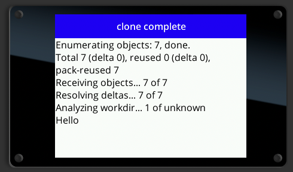

# Port of Isomorphic-Git to Moddable SDK
#### Updated May 17, 2020
#### Peter Hoddie

## Introduction

Porting work began April 30, 2020

At this time, the port barely does anything useful. It can clone a nearly empty repository containing a single file
that just says "Hello" but even that nearly exhausts the Moddable Two's memory.

### Building and running

- Download the latest Moddable SDK (May 15 2020 or later)
- `cd ${isomorphic-git}/src`
- `rm -rf /tmp/moddable-test/ && mcconfig -d -m -p mac` to build for and run on Mac simulator
  - if you get this error (`/moddable/modules/network/http/http.js (193) # Exception: throw!`) then re-run it
- `mcconfig -d -m -p esp32/moddable_two ssid="$YOUR_WIFI_NETWORK" password="$YOUR_WIFI_PASSWORD"` to build for and run on ESP32

> Note: All modules are preloaded. This saves RAM and decreases load time, both critical for embedded targets.

If successful the final screen looks like this:



If running on a Mac, you can verify the packfile index as follows:

```sh
cd /Users/Shared/tmp/moddable-test
git verify-pack -v .git/objects/pack/pack-fb367774ad41abbfdc2f4be55149f57987e47eea.idx
```

you should see:
```
a7a551b6710166fe65c4894a4f88f785e4fb7393 commit 223 152 12
c03e131196f43a78888415924bcdcbf3090f3316 commit 1049 794 164
5a8905a02e181fe1821068b8c0f48cb6633d5b81 commit 1021 771 958
48af7b9b559ef89fc4a41d492282c927d63f306b tree   66 71 1729
e965047ad7c57865823c7d992b1d046ea66edf78 blob   6 15 1800
18df7980ddf987c2e3e20eb8007727c659b37216 blob   7 16 1815
a69b2f53db7b7ba59f43ee15f5c42166297c4262 tree   33 43 1831
non delta: 7 objects
.git/objects/pack/pack-fb367774ad41abbfdc2f4be55149f57987e47eea.pack: ok
```

### Module specifiers

The original code uses relative paths to import modules. On embedded targets, the Moddable SDK does not support relative paths, only bare module specifiers. All relative path module specifiers needed to build and launch have been converted to bare specifiers. This is incompatible with web hosts. Eventually a better solution is needed

### Resolved issues

- `models/GitConfig.js` - cannot preload as-is because it creates `RegExp` instances at the top level. Worked around with lazy creation of the `RegExp` instances.
- Avoided need for `pify`  implementing promise support directly in host provided FS
- asyncLock relies on `process.domain`. Providing a stub works.
- Code uses `Buffer`, a subclass of Uint8Array Implemented a few needed methods.
- Implemented http object
- Added `console.log` that maps to `trace` for XS
- `BaseError` implements getter/setter to allow error objects to be preloaded (works around "override mistake")
- XS does not support nulls in strings. The `splitAndAssert` code depends on those. Workaround implemented. It looks like this may appear in other places (`readObject`)
- [X] Moddable File is flat FS only.... OK... let's fix that.
  - [x] `createDirectory` implemented for macOS simulator for development
  - [X] FAT32 support for ESP32 added
- [x] SHA module should use Moddable SDK crypto -- smaller and faster

### Open issues 

- Use native miniz instead of pako.
  - [x] inflate, including streaming API
  - [ ] deflate (TODO: do we need this? It's only used for loose object file format)
- `utils/supportsDecompressionStream` is unneeded on Moddable target

### Stub Notes:

#### "utils/sha1": "../packages/native/sha1"

This seems to work now! To swap in pure JS version, use "./utils/sha1"

####  "pako": "../packages/native/pako"

This seems to work now! To swap in pure JS version, use "../node_modules/pako/dist/pako.min" (Uses patch in `patches` folder applied by `npm run postinstall`)

####  "utils/toHex": "../packages/native/toHex"

This seems to work now! To swap in pure JS version, use "./utils/toHex"

####  "crc-32": "../node_modules/crc-32/crc32"

Uses patch in `patches` folder applied by `npm run postinstall`

####  "async-lock": "../node_modules/async-lock/lib/index"

Uses patch in `patches` folder applied by `npm run postinstall`

####  "clean-git-ref": "../node_modules/clean-git-ref/lib/index"

Uses patch in `patches` folder applied by `npm run postinstall`

####  "git-apply-delta": "../packages/stub/git-apply-delta"

- [ ] TODO: write a patch or rewrite
